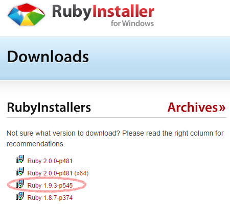

Tutorial para la instalación de Ruby en Windows.
=========

* Instalación de Ruby en Windows:
	1. Usaremos la pagina web de Ruby Installer para descargar lo necesario. Descargaremos la version mas estable (1.9.3) y el DevKit correspondiente
>>  
>
>>  
>

	2. Ejecutamos el ".exe" de ruby y lo instalamos (si queremos podemos dejar todas las opciones por defecto). Luego descomprimiremos el DevKit.

	3. Para instalar completamente el DevKit ejecutaremos la consola de windows "cmd" y nos pondremos en el directorio donde hayamos descomprimido el DevKit. Entonces usamos los comandos ***"ruby dk.rb init"*** y ***"ruby dk.rb install"*** en ese orden.
	
>>  
>
	
	4. Podemos comprobar que ruby (la versión que queremos) está instalada con un simple ***"ruby -v"*** en la propia consola.

* Actualizando, instalando y probando las gemas:

	1. Ahora actualizaremos las gemas con el siguiente comando ***"gem update"*** :
        
>>  
>

	2. Momento entonces de instalar bundler introduciendo desde la propia consola ***"gem install bundler"*** :

>>	
>
	
	3. Luego procedemos a instalar la gema twitter y sinatra con un ***"gem install twitter"*** y ***"gem install sinatra"*** :
	
>>   
>
>>   
>
	
	4. Probaremos la gema sinatra con una pequeña aplicación en ruby. Creamos el fichero hello.rb escribimos el siguiente codigo y lo ejecutamos.
	
>>   
>
>>   
>

Santiago Sainz Fdez.
